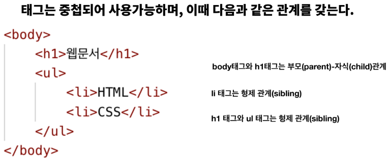
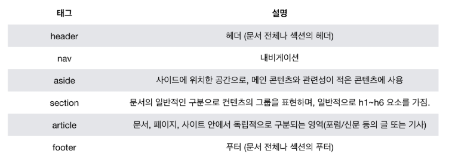

# 0810_정리

## HTML

:Hyper Text Markup Language

:웹 페이지를 작성하기 위한 역할 표시 언어

:HTML 파일은 HTML로 작성된 문서 파일.

### HTML 문서의 기본 구조

1. DOCTYPE 선언부

   : 사용하는 문서의 종류를 선언하는 부분. 보통은 html을 사용한다.

2. HTML 요소

   : HTML 문서의 최상위 요소로, 문서의 root를 뜻한다.

    head+ body 부분

3. head 요소

   : 문서 제목, 문자코드(인코딩(ex.charset="UTF-8"))와 같이 해당 문서 정보를 담고 있으며, 브라우저에는 나타나지 않는다.

   :CSS 선언 혹은 외부 로딩 파일 지정 등을 작성합니다.

   :og와 같은 메타태그 선언이 이뤄진다.

4. body 요소

   : 브라우저 화면에 나타나는 정보로, 실제 내용이다.

### Tag와 DOM TREE    (Document Object Model)

1. HTML의 element는 태그와 내용(contents)로 구성되어 있다.

   	<h1>
      	    웹문서
      	</h1>
   태그는 소문자로!

   요소간의 중첩도 가능.

2. 닫는 태그가 없는 태그도 존재한다.

    

3. 태그에는 속성이 지정될 수 있다.

   <a href = 'google.com'/>

   여기서 href = 속성명, google.com = 속성값.

   (id, class, style은 태그와 상관없이 모두 사용 가능하다.)

4. DOM 트리

   : 태그는 중첩되어 사용 가능하며, 이 때 다음과 같은 관계를 가진다.

   

5. 시맨틱 태그

   : 컨텐츠의 의미를 설명해주는 태그로써, HTML5에 새롭게 추가된 시맨틱 태그가 있다.

